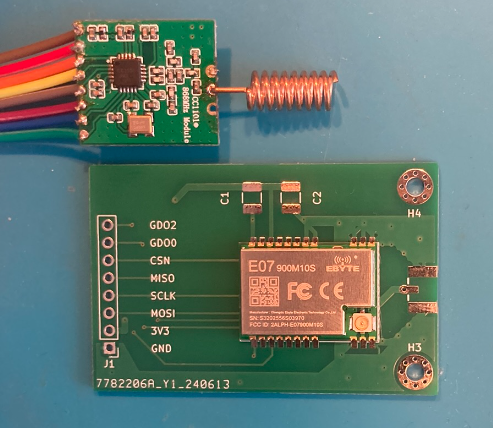
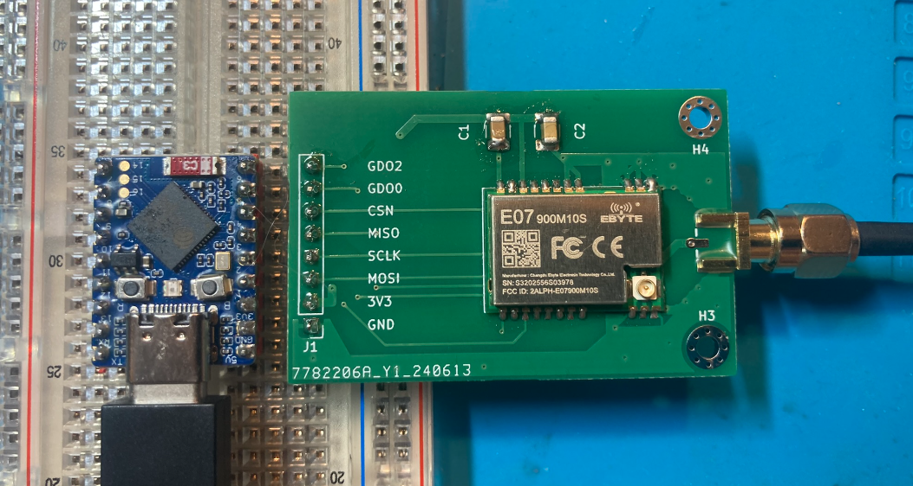

# e07-900m10s-breakout

Breakout board for [ebyte e07-900m10s CC1101 module](https://www.ebyte.com/en/product-view-news.html?id=1567)

Breakout board vs well-known (but usually not working) CC1101 module for size:

Connected to waveshare ESP32 s3 mini (ramses_esp clone)

 - The header is a standard .1" (2.54mm) PCB header.
 - C1 and C2 are 1206 SMD size
 - C1 = 100nF
 - C2 = 4.7uF
 - These caps are probably not needed. C1 is used to smooth Vcc and C2 as a buffer for large currents while sending.

This is my first KiCad/PCB. I'm happy it works!

This repo contains the KiCad 8 files as well as the gerbers to produce the PCB.
I used JLPCB for my board. Just upload the zip-file in the gerber folder to JLPCB.
